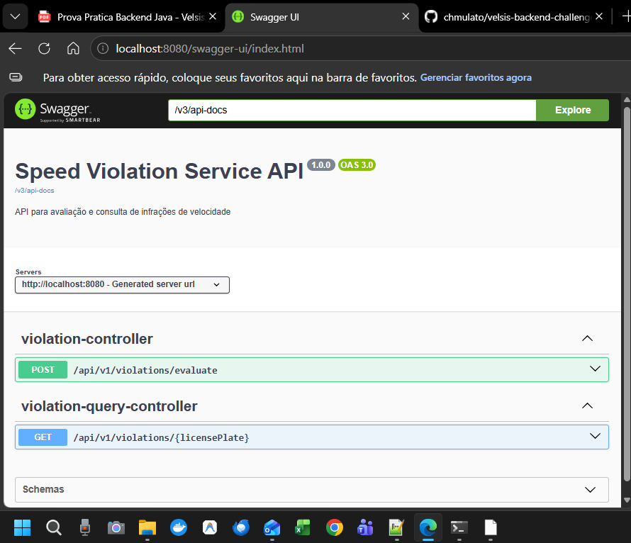

# Speed Violation Service

Microserviço desenvolvido como prova prática para a Velsis Sistemas e Tecnologia Viária.  
O serviço processa leituras de velocidade captadas por equipamentos de fiscalização, aplica a tolerância legal, calcula o excesso percentual e determina se houve infração conforme o Código de Trânsito Brasileiro (CTB).  
Infrações são armazenadas em memória e podem ser consultadas por placa.

---

## 1. Tecnologias Utilizadas
- Java 21  
- Spring Boot 3.x  
- Maven  
- Springdoc OpenAPI (Swagger)  
- JUnit 5  

---

## 2. Estrutura do Projeto

```plaintext
workspace_velsis/
 ├── pom.xml
 ├── README.md
 ├── .gitignore
 ├── img/
 └── src/
      ├── main/
      │    ├── java/
      │    │     └── com/
      │    │          └── mulato/
      │    │               └── api/
      │    │                    └── speedviolation/
      │    └── resources/
      │          └── application.yml
      └── test/
           └── java/
                └── com/
                     └── mulato/
                          └── api/
                               └── speedviolation/
```

---

## 3. Como Executar

### Pré-requisitos

- JDK 21 instalado
- Maven 3.9+ instalado

### Rodando o projeto

Passo 1: Limpar e compilar o projeto
mvn clean install

Passo 2: Executar a aplicação usando o Maven
mvn spring-boot:run

Passo 3: Executar a aplicação usando o arquivo JAR
java -jar target/speedviolation-1.0.0.jar

Passo 4: Rodar os testes
mvn test

A aplicação inicia na porta padrão 8080.
Para alterar a porta, edite o arquivo:
src/main/resources/application.properties

Exemplo:
server.port=8080

### Desafios Encontrados Durante o Desenvolvimento

Durante o desenvolvimento deste projeto, alguns desafios técnicos se destacaram e contribuíram para o amadurecimento da solução. O primeiro deles foi a configuração do ambiente de compilação. Embora o projeto utilizasse recursos modernos do Java, como records e switch expressions, o Maven inicialmente estava configurado para compilar com Java 8, o que gerou erros de incompatibilidade. A correção exigiu o ajuste explícito das propriedades de compilação para Java 21 e a adoção do spring-boot-starter-parent, garantindo que todas as dependências fossem resolvidas corretamente.

Outro ponto importante foi a estruturação do contexto do Spring Boot. No início, os testes não conseguiam localizar a classe principal da aplicação, resultando no erro “Unable to find a @SpringBootConfiguration”. A criação da classe SpeedViolationApplication e a organização adequada dos pacotes resolveram esse problema e permitiram que os testes de controller fossem executados corretamente.

O tratamento de erros também exigiu atenção especial. Alguns cenários, como header ausente ou valores inválidos para enums, estavam retornando respostas 500, quando o comportamento esperado era 400. A implementação de handlers específicos no GlobalExceptionHandler garantiu que o serviço respondesse de forma consistente e alinhada com as regras da prova.

Por fim, a implementação do endpoint de consulta trouxe desafios adicionais relacionados à estrutura de pacotes e imports ausentes. A criação do ViolationQueryService e a correção dos imports no controller eliminaram os erros de compilação e permitiram a inclusão de testes dedicados para esse endpoint.

Esses desafios, embora naturais em um projeto com múltiplas camadas, contribuíram para uma solução mais robusta, bem estruturada e alinhada com as boas práticas do ecossistema Spring Boot.



---
### Persistência em Memória (Conforme Requisito do Teste)

O PDF da prova prática da Velsis especifica que não deve haver uso de banco de dados.
Todas as infrações são armazenadas em memória utilizando um repositório interno
(InMemoryViolationRepository), conforme solicitado. O objetivo é avaliar a lógica
de apuração, validações e organização do código, sem dependências externas.

## 12. Checklist de Conformidade com o Teste da Velsis

Esta seção valida ponto a ponto os requisitos funcionais e não funcionais descritos no PDF da prova prática.

### RF1 — Endpoint de Apuração
- POST /api/v1/violations/evaluate implementado
- Header obrigatório x-origin validado (FIXED, MOBILE, HANDHELD)
- Corpo validado conforme especificação
- Respostas 200 para casos com e sem infração
- Respostas 400 para erros de validação

### RF2 — Validações
- Placa nos formatos antigo e Mercosul (regex compilada como constante)
- measuredSpeed > 0
- speedLimit > 0
- equipmentId obrigatório
- captureTimestamp em ISO-8601 e não futuro
- x-origin obrigatório e válido

### RF3 — Regras de Apuração
- Tolerância fixa de 7 km/h para velocidades até 100 km/h
- Tolerância percentual de 7% (truncado) para velocidades acima de 100 km/h
- Cálculo do excesso percentual implementado
- Classificação conforme CTB Art. 218:
  - MEDIUM (≤ 20%)
  - SERIOUS (> 20% e ≤ 50%)
  - VERY_SERIOUS (> 50%)

### RF4 — Persistência e Consulta
- Armazenamento em memória conforme solicitado
- Apenas infrações são persistidas
- GET /api/v1/violations?licensePlate=ABC1D23 implementado

### RF5 — Tratamento de Erros
- ControllerAdvice implementado
- Mensagens claras e sem stack trace para o cliente
- Logs contendo placa, equipamento, tipo de erro e timestamp

### RF6 — Casos Especiais
- Velocidade dentro da tolerância → sem infração
- Exatamente 20% e 50% tratados corretamente
- Velocidade acima de 100 km/h com tolerância percentual
- Timestamp futuro → erro 400

---

## 13. Checklist de Requisitos Não Funcionais

### RNF1 — Organização do Código
- Camadas separadas: controller, service, repository, model
- DTOs usando records para imutabilidade
- Regex como constante estática

### RNF2 — Configuração Externalizada
- application.yml contendo:
  - tolerance.fixed
  - tolerance.percent
  - tolerance.percentLimit

### RNF3 — Testes
- Testes unitários cobrindo:
  - tolerância
  - excesso percentual
  - classificação
  - validações
  - casos de borda
- Testes de controller incluídos

### RNF4 — Documentação
- README completo
- Exemplos de requisição (curl)
- Swagger/OpenAPI disponível

### RNF5 — Qualidade de Código
- Clean Code aplicado
- Sem prints ou código morto
- Nomes claros e padronizados

---

## 14. Conclusão

Todos os requisitos funcionais e não funcionais descritos no PDF da prova prática foram implementados.  
O projeto está pronto para avaliação técnica pela equipe da Velsis.
